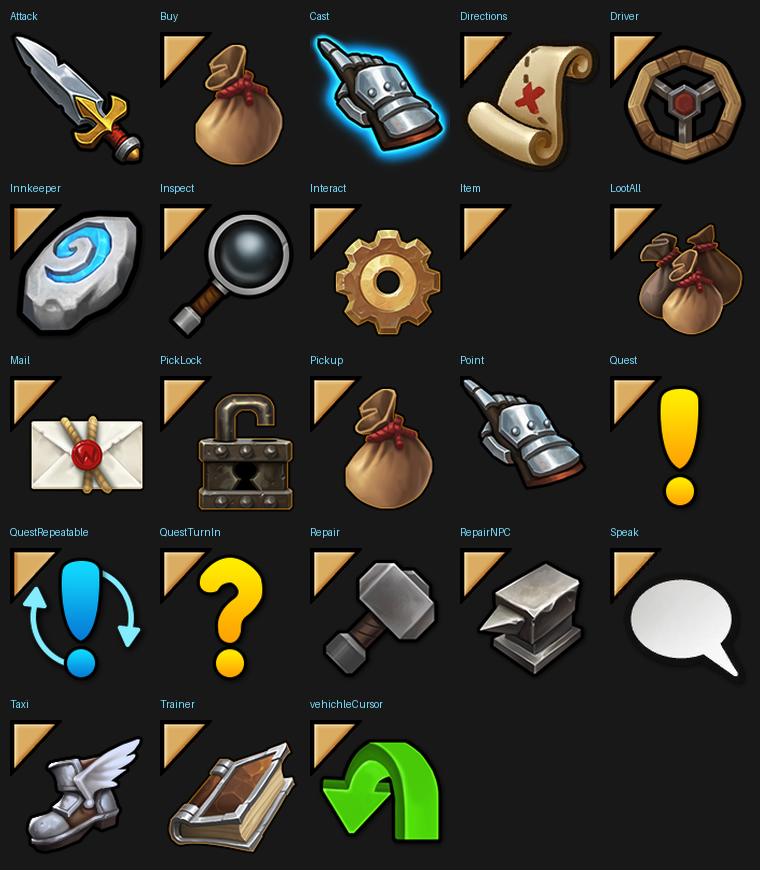

# Retail Cursor Pack

Modern retail-style cursors for World of Warcraft 3.3.5a.



## Install

1. Copy `patch-y.mpq` into `World of Warcraft\Data\`
2. If the cursor turns invisible, add this line to `WTF\Config.wtf`:
   ```
   SET gxCursor "0"
   ```
3. Restart the client completely.

## Uninstall

Delete `patch-y.mpq` from `Data\`.

## What's included

23 of the 33 real cursors in 3.3.5a, replaced with their current retail
look. The other 10 are left as the original icons — no modern equivalent
has been found for them.

## Credits

Created by **NeticSoul**.

All cursor artwork is property of Blizzard Entertainment. Unofficial fan
mod, not affiliated with or endorsed by Blizzard Entertainment.
